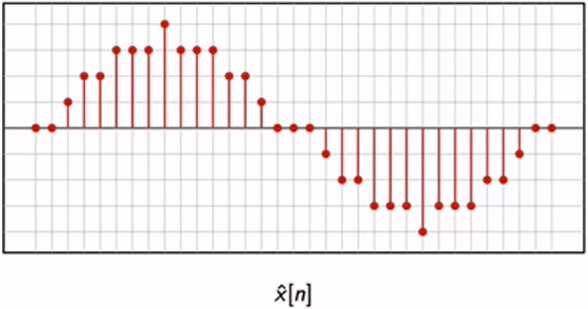
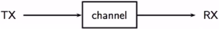
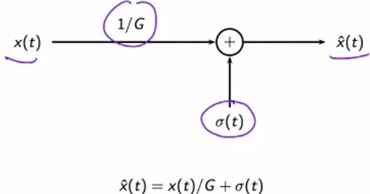
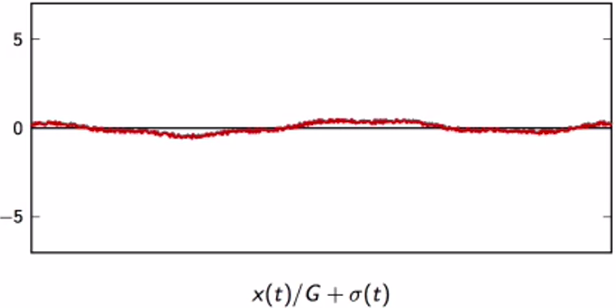
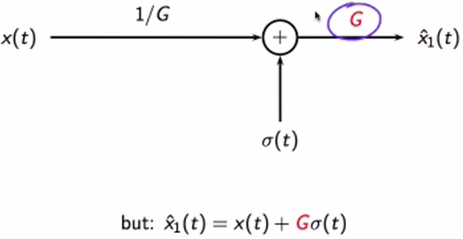
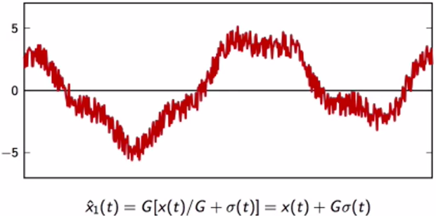
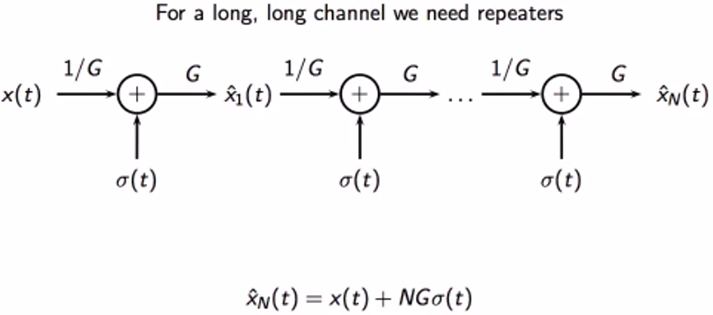
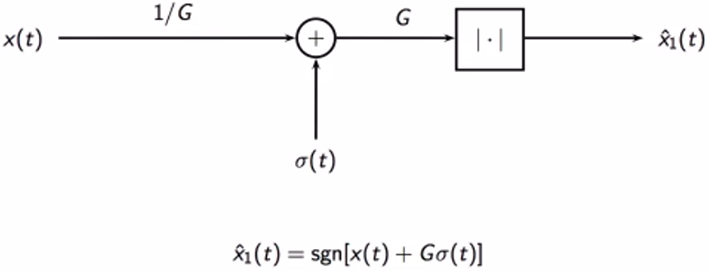

# Introduction
## Check the items are intuative after finishing the next video
- [x] Idealized abstraction in which we describe things by a way of functions, and we use calculus
- [x] More pragmatic approach in which we describe things via sets of numerical measurements

## Video: What is digital signal processing
`Analysis` and `Syntheis`

Mathematical model to represent the signal

- The paradox generally says that as there are infinite sub-segments between A and B, there's no way to properly calculate how long left. Thus, one cannot actually reach B from A.
- The below calculus equation can be naively thought as the explanation for the paradox. But it is not.
- The solution to the paradox was proved by research of the last 4 centuries, that ** infinite sums do not lead to contradictions **

- Analog way of analysing a signal

- Discrete way of analysing that signal

### The sampling theorem

- Continuous (time) representation can be equal to discrete (time) representation

- The `sinc` function

- Samples of a continuous time signal taken at an interval

- The sum of all the scaled (by the discrete samples) copies of the sinc forms the exact continuous signal
- The condition of the theorem is ensured by **the Fourier analysis**
    - which tells how long an interval should be

`attenuation`, `noise`, `amplifier` trying to undo the attenuation

- Values can be uniformed into a set of values

The general model of a transmission looks like this

- Inside the channel

    
        - <explain here>

The transmitted signal gets attenuated and noisy at the end of a transmission
    

- Compenstate the attenuated signal by multiplying the hypothesis with G

    

- However, doing that also amplifies the noise

    

- For long-distance transmissions, `repeaters` are needed

With digital signals, the general flow is the same, but one thing new: The `threshold`
    

- Amplified noise after the attenuation compensation

    

- Applying thresholds has the values greater than 5 become 5, less than -5 become -5, thus, ideally, recovered the original signal.