# 1.1.2. Discrete-time signals

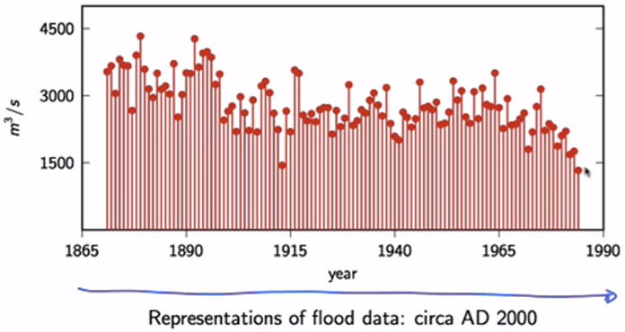

- This plots data in lollipop notation, which is used to strongly emphasize discrete-time feature of the signals

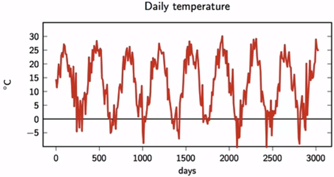
- If the data needed to be plot is to dense, here daily over roughly ten years, the plot (each record is a dot) looks like above
- Despite of its look as an continuous signal, it is discrete
- Notice how the pattern repeats every ~ 365 days

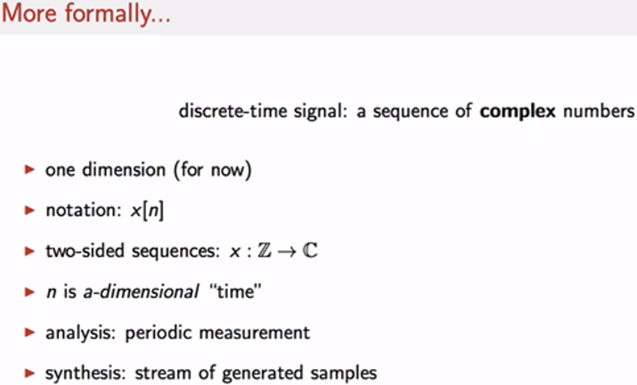

- Notice `analysis` and `synthesis`

## Some typical signals
### Delta signal
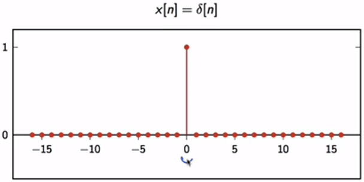 

The `delta` signal represents something's single useful moment, like the clap of a clapper to sync audio and video together

### Unit step signal
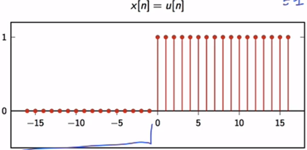 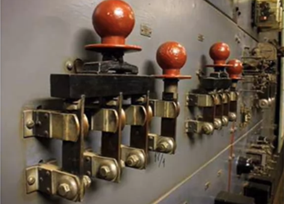

### Exponential decay
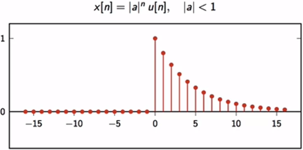
- As $ |a| < 1 $, successive powers show `decay` "feature" of the signal
- Notice how the `unit step` function $ u[n] $ keeps 
    - the ">=0" range showing decay from 1 down to close zero
    - the "<0" range zero, not allowing value to go enormous
- This decay describes lots of phenomenons: How fast a cup of coffee gets cold (also check Newton's law of cooling), how fast a capacitor discharges

### Sinusoid
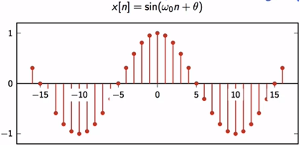
- Oscillations

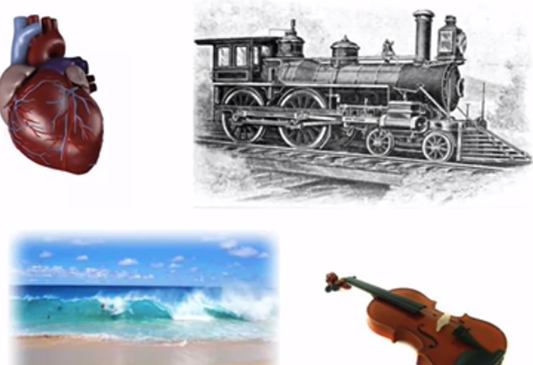

## Signals too, but categorized
### Finite length signals
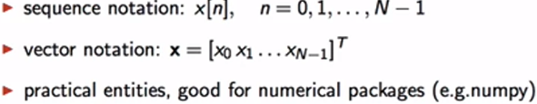

### Infinite length signals
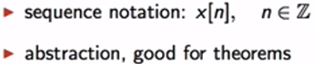

### Periodical signals
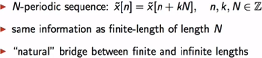
- The values of the samples repeat after an interval
- Notice the $\tilde{x} $ notation

### Finite-support signals
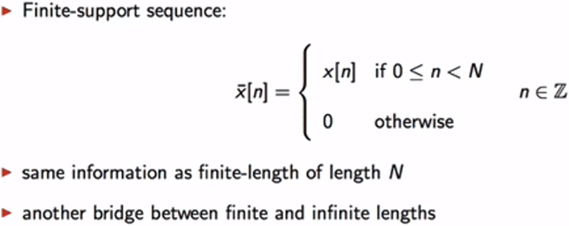
- They are infinite-length signals with only a finite number of non-zero samples
- Notice the $ \bar{x} $ notation

## Elementary operators
- Scaling: $ y[n] = \alpha x[n] $
- Sum: $ y[n] = x[n] + z[n] $
- Product: $ y[n] = x[n] \cdot z[n]$
- Shift by k (delay): $ y[n] = x[n - k] $ (Must be careful with finite length signals about out of range issue)