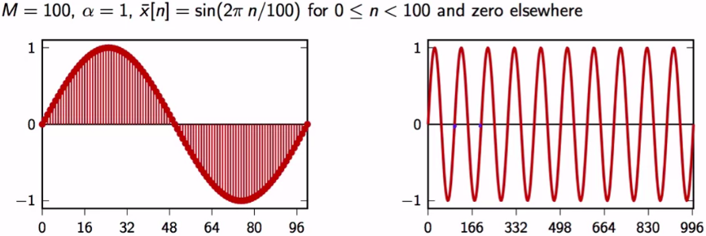

# 1.1.3.b. The Karplus-Strong algorithm

## Building blocks
### Adder

### Multiplier

### Unit delay

### Arbitrary delay

## Moving average

### Moving average on act
- Delta:

- Notice how $ y[0] $ and $ y[1] $ got averaged out. But not $ y[2] $ (The right-handed graph is the graph of the output, don't confuse)

- Sinusoidal:

## A recursion

- An initial condition of 0 for each memory cell ($ z^{-1} $) must be set.

## Make some music
### Some bullets 

### A simple example

- If we play that with the sampling frequency of 48KHz, the pattern will repeat every 100 samples

- Some realism

- The Karplus-Strong algorithm
