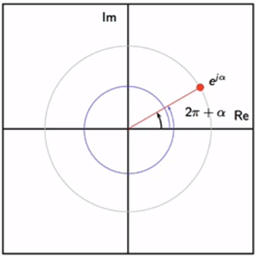
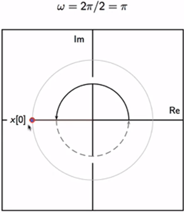
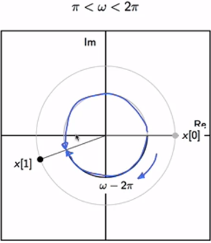
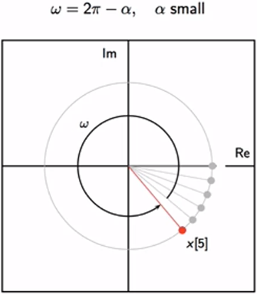
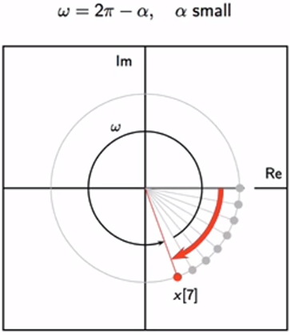

# Intro
We have seen some examples of discrete-time signals two lessons ago. This lecture is devoted entirely to a type of signal that will play a fundamental role in many topics to come, from Fourier analysis to data modulation and filtering: the complex exponential.

The complex exponential describes in compact form an oscillatory behavior with a given frequency and an initial phase; the complex-valued notation is both convenient and practical and is the standard in digital signal processing. The only caveat is that, in discrete time, the concept of frequency becomes a bit tricky because of a phenomenon called "aliasing".

# Main content

## A friendly look on oscillations in our world

## Oscillations

- A point moves round and creates a circle. Place a coordinate frame in the center of the circle. That point can be described by coordinates with triogonmetric functions $x_1(t) = sin(\omega t)$ and $x_2(t) = cos(\omega t)$.

- Or, which is easier, it can be described by Complex reference system. It can be denoted as $ x(t) = e^{j \omega t} $, in which $ \omega $ is the rotational frequency, and $ t $ is a real number indicating time.

### The discrete-time representation

$$ 
x[n] = Ae^{j (\omega n + t)} \\
    = A \cos{(\omega n + \phi)} + j\sin{(\omega n + \phi)}
$$

- frequency $\omega$ (radians)
- initial phase $\phi$ (radians)
- amplitude $A$

## Complex exponential

Generate a sequence using complex exponential:

- The graph helps us infer that the $\omega = \frac{2\pi}{12}$

- If an arbitrary $\omega$ is chosen, a individual point can possibly never repeated.

### 2-pi periodicity

- One point, many names ($e^{j\alpha}$ can also be $e^{j(4\pi + \alpha)}$ or $e^{j(-2\pi + \alpha)}$). This is called `Aliasing`

- Speaking in discrete-time context, `Aliasing` poses a limit on how fast to go around a unit circle.

 

- 2 keynotes: 
    - Range: $\pi < \omega < 2 \pi$
        - Consider $\omega > \pi$, trying to go faster than pi in each step in one direction also means going slower in the other direction:

- Consider $\omega < 2\pi - \alpha$ ($\alpha$ is very small), which means the speec $\omega$ is very fast:

 

- Subsequent steps "coincidentally" got in the **clockwise** pattern
                            
    - This exlains why the car wheels in movies look like going backward while the car obviously move forward (The rotation speed of the wheel is larger than the frame rate of the camera)

## Reference
- Take a look at the relationship between Euler's formula $ e^{j\omega} = a + jb $ and Trigonometry [here](../docs/eulerformula.pdf). Briefly speaking, it applies the reasoning in trigonometry fashion to the fashion in a Complex plane by mapping the cosine-and-sine to the real-and-imaginary.