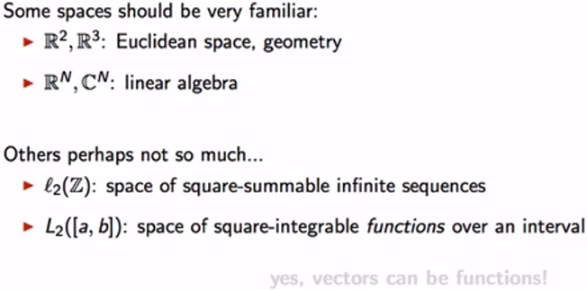
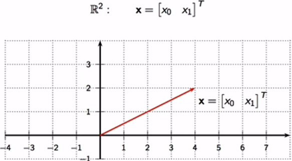
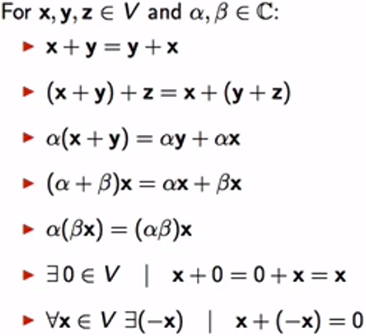
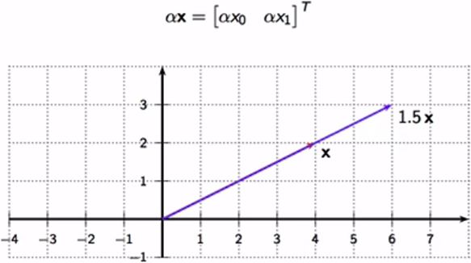
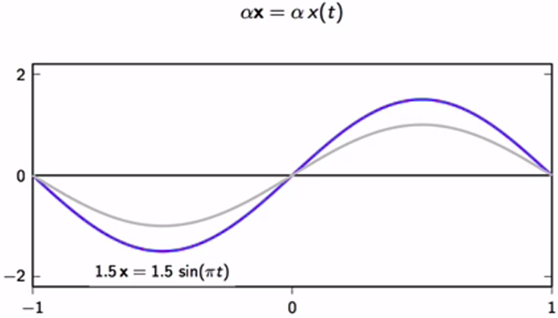
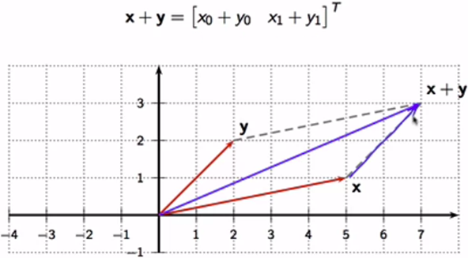
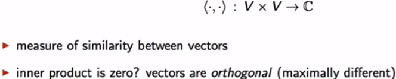
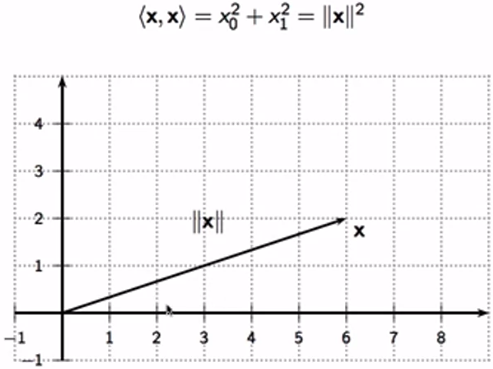

# 1.2.2 Vector spaces

## Properties of a vector space

### Scalar multiplication

- Notice the representation in the graph

#### Scalar multiplication in L2[-1, 1]

### Addition

- Notice the transpose $T$ notation, which is required as vectors have to be in column shape

## Inner product aka dot product

- Notice the inner product notation of $a$ and $b$ $\langle a, b \rangle$

### `Self-inner product`

- Notice the self-inner product of $x$ being resulted from the sides of the orthogonal triangle (Pythagoras theorem), geometrically speaking

- Notice `the norm` notation $||x||$ of the vector **$x$**