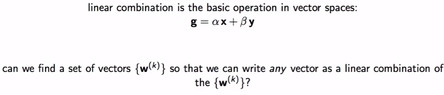
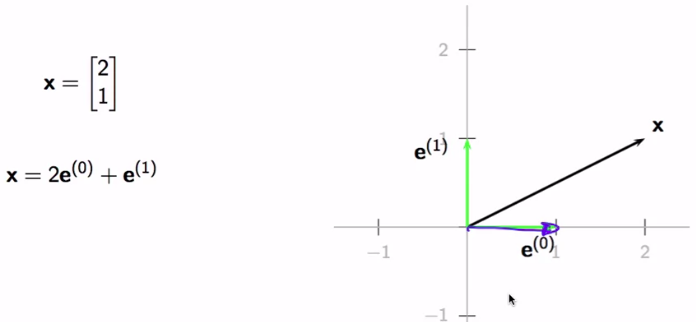
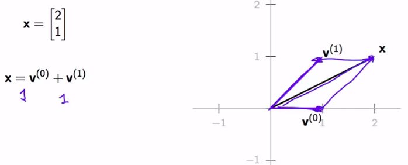
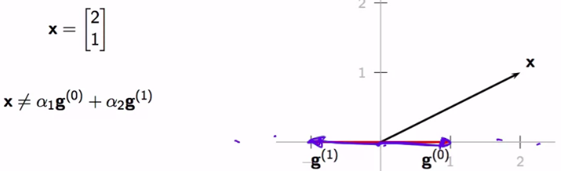
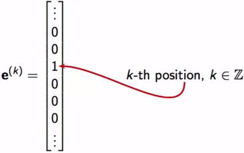
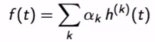
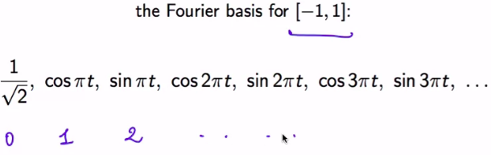
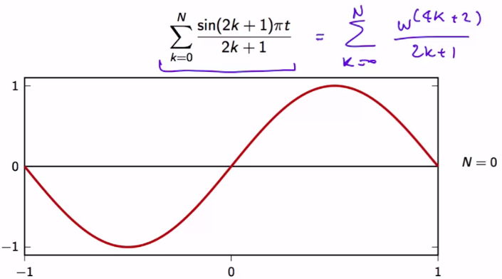
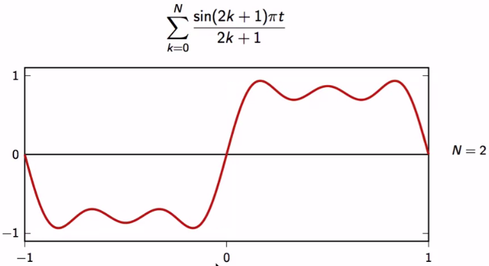
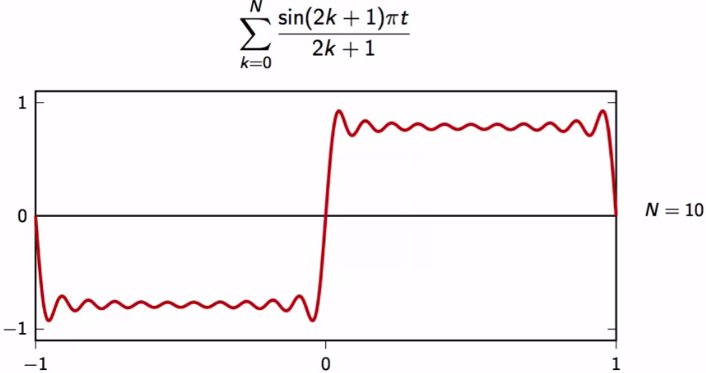

# Intro

A basis is a vector space's "skeleton", so to speak. It gives the space structure and allows us to decompose any element in the space into a linear combination of simple building blocks, namely, the basis vectors. Bases are extremely important in signal processing: we will see in the next module that the Fourier Transform is simply a change of basis. 

# Content

- Notice the $\{w^{(k)}\}$ notation to indicate the set of the (base) vectors

Examples:

- $g^{0}$ and $g^{1}$ are not linearly independent (so they're linearly dependent?). As a result, we cannot describe any vector with this pair of vectors

"Can we describe an infinite length signal?". Yes.

Basis for function vector spaces

- One of the most famous is the Fourier basis

    

    - interval $[-1,1]$
    - basis vector 0, 1, 2, ...

    - Take a look at an example

    

    - Notice how $\sin{\pi t}$ corresponses to 2 (in the image above) and accordingly expressed in the handwritten equation

     

    - The more we add, the more we approximate to the function that we want to approximate