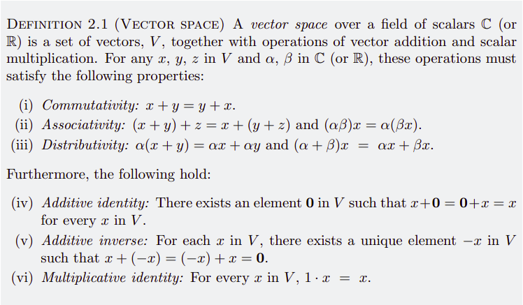
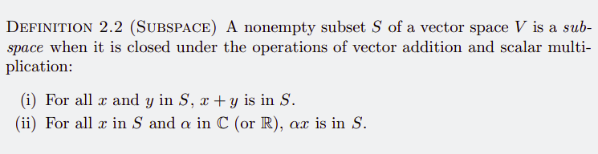

# Vector spaces

- [ ] Products
- [ ] Norms
- [ ] Metrics

- The bold **0** vector is different from the 0 scalar!

- The operations of vector addition and scalar multiplication can be used to define many other vector spaces

- Distinguish "componentwise addition and multiplication" and "natural operations of addition and scalar multiplication" of functions

- Not yet so clear about this definition

-- take a look at "solved exercise 2.1"

Quick look-backs on linear algebra: Appendix 2.B
