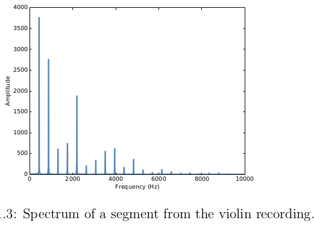
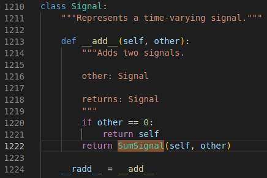
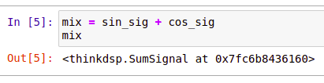
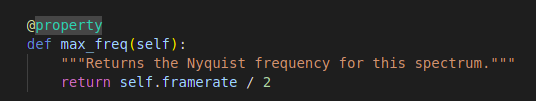
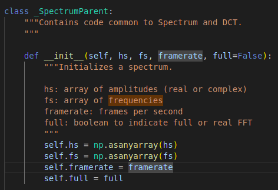

# Terms
The shape of a periodic signal is called the **waveform**.

The shape of the waveform determines the **timbre** (the quality of the sound)

Got the spectrum of a signal (which displays different frequencies and the amplitudes for each frequency component). The lowest frequency component is called the **fundamental frequency**

The frequency with the largest amplitude is called the **dominant frequency**

Frequencies that are integer multiples of the fundamental frequency is called **harmonics**

880 is one octave higher than the fundamental. An **octave** is a doubling in frequency

# Claims
The most important **topic** in this book is **spectral decomposition**, which is the idea that **any signal can be expressed as the sum of sinusoidal signals of different frequencies**

The most important **mathematical idea** in this book is the **discrete Fourier transform (DFT)**, which **takes a signal and produces its spectrum** (the set of sinusoids that add up to produce the signal)

The most important **algorithm** in this book is the **Fast Fourier transform (FFT), an efficient way to compute the DFT.**

# Facts
The frequency of this signal is about 439 Hz, slightly lower than **440 Hz**, which is the **standard tuning pitch for orchestral music** (note A4).

Most instruments generate periodic sounds, but the shape of these are not sinusoidal.

11025 frames per sec is one of the common framerates in audio file formats like .wav and .mp3

===
@property in Python

Why only sine and cosine are considered in signal processing?

- The code implements the `add` operator, resulting in the usage like this

--> Take a look at how Python works to make that operator implementation possible

Why I get 22050 everytime I use `max(spectrum.fs)` (wanted to get the highest frequency). Btw, differentiate the two of these frequencies!
 